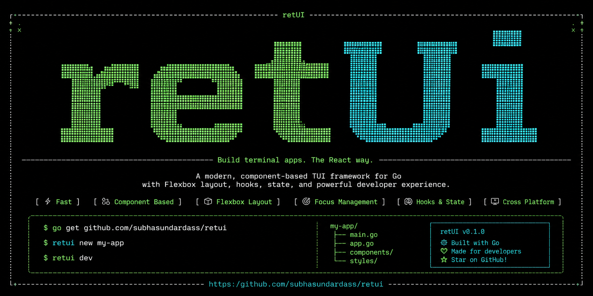

# retui

A Go framework for building interactive terminal UIs with React-style components and hooks.

Inspired by React and Flutter, retui brings a component-based, reactive approach to building terminal applications — write functional components, manage state with hooks, and let a flexbox layout engine handle the rest.



## Table of Contents

- [Features](#features)
- [Installation](#installation)
- [Quick Start](#quick-start)
- [Contributing](#contributing)
- [License](#license)

## Features

- **Functional components** — plain Go functions that return an `Element` tree
- **Hooks** — [`UseState`](DOCS.md#usestate), [`UseEffect`](DOCS.md#useeffect), and [`UseContext`](DOCS.md#usecontext)
- **Flexbox [layout engine](DOCS.md#layout)** — two-pass (measure → layout) with `Row`/`Column` direction, `Gap`, `Padding`, `Align`, `Justify`, and `Fixed`/`Grow`/`Fit` sizing
- **Rich [styling](DOCS.md#styling)** — ANSI16, ANSI256, and RGB/Hex colors; bold, italic, underline; four border presets
- **Bracketed paste** — multi-line clipboard content arrives as a single `KeyPaste` event
- **Built-in [component library](DOCS.md#component-library)** — Table, Tabs, Modal, Input, Button, Checkbox, List, SelectPicker, Spinner, ProgressBar, Alert, Badge, Panel
- **Efficient rendering** — cell-level diffing; only changed cells are written to the terminal
- **Full Unicode support** — proper character-width handling via `go-runewidth`

## Installation

```bash
go get github.com/subhasundardass/retui
```

Requires **Go 1.21+**.

## Quick Start

```go
package main

import (
    "fmt"

    "github.com/subhasundardass/retui/retui"
)

func App(props retui.Props) retui.Element {
    count, setCount := retui.UseState(0)

    if retui.CurrentKey.Code == retui.KeyEnter {
        setCount(count + 1)
    }

    label := retui.NewStyle().Bold(true).Foreground(retui.Cyan)

    return retui.Box(
        retui.Props{Direction: retui.Column, Gap: 1, Padding: [4]int{1, 2, 1, 2}},
        retui.NewStyle(),
        retui.Text("Press Enter to count, Ctrl-C to quit", retui.NewStyle()),
        retui.Text(fmt.Sprintf("Count: %d", count), label),
    )
}

func main() {
    app := retui.NewApp(0, 0)
    app.Run(App, retui.Props{})
}
```

Run it:

```bash
go run .
```

> **Note:** Press **Ctrl-C** to exit — there is no `Exit()` function.

For a full walkthrough of components, hooks, layout, and styling, see [`DOCS.md`](DOCS.md).

### Try the Example App

The repo ships with a demo app that exercises all the built-in components. Run it with:

```bash
go run ./cmd/app
```

Use it to check that components (Table, Tabs, Modal, Input, Button, Checkbox, List, SelectPicker, Spinner, ProgressBar, Alert, Badge, Panel, and more) are working as expected.

## Contributing

Contributions are welcome! Please follow these guidelines to keep the codebase consistent.

### Getting Started

```bash
git clone https://github.com/subhasundardass/retui
cd retui
go mod download
go test ./...
```

### Workflow

1. **Open an issue first** for non-trivial changes to align on the approach before writing code.
2. **Branch off `main`:**
   ```bash
   git checkout -b feature/my-feature
   ```
3. **Keep commits focused** — one logical change per commit with a clear message.
4. **Add tests** for new layout or rendering behaviour in `*_test.go` files.
5. **Run tests and vet before opening a PR:**
   ```bash
   go test ./...
   go vet ./...
   ```
6. **Open a pull request** against `main` with a description of what changed and why.

### Code Style

- Follow standard Go conventions (`gofmt`, `golint`)
- Keep component functions pure where possible; side effects belong in `UseEffect`
- Avoid adding dependencies; the stdlib plus the two existing deps cover most needs

### Adding a Component

1. Write the component function in the appropriate file under `retui/components/`.
2. Use plain typed parameters where possible; reserve `props.Values` for genuinely dynamic data.
3. Add a runnable demo under `examples/<your-feature>/main.go`.
4. Document the signature, keyboard contract, and a usage snippet in [`DOCS.md`](DOCS.md) under the relevant section.

### Reporting Bugs

Open a GitHub issue with:

- Go version (`go version`)
- Terminal emulator and OS
- Minimal reproduction case
- What you expected vs. what happened

## License

MIT — see [LICENSE.md](LICENSE).
